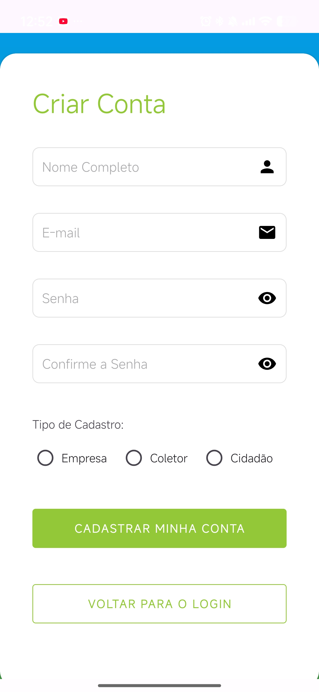
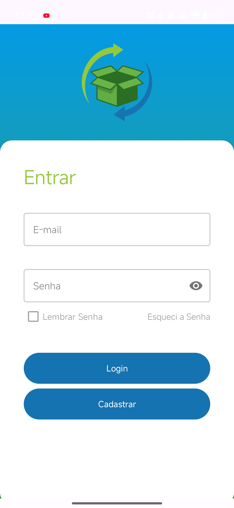
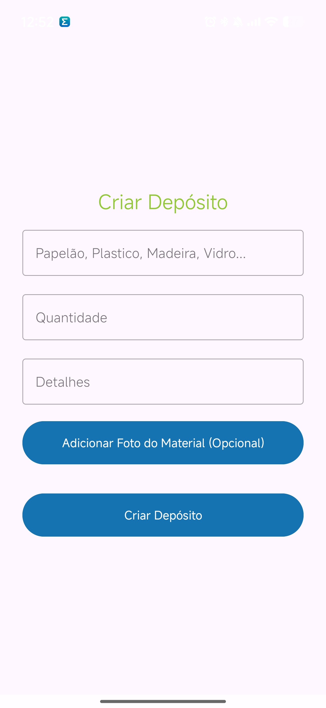
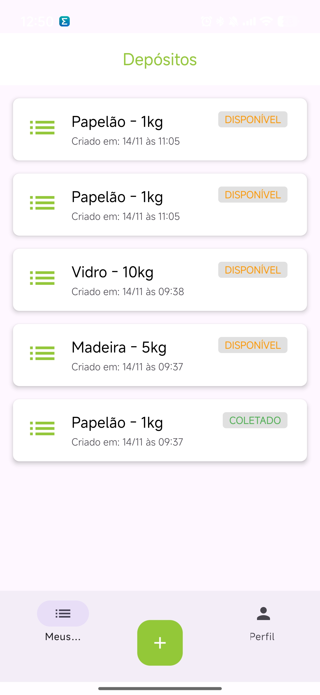
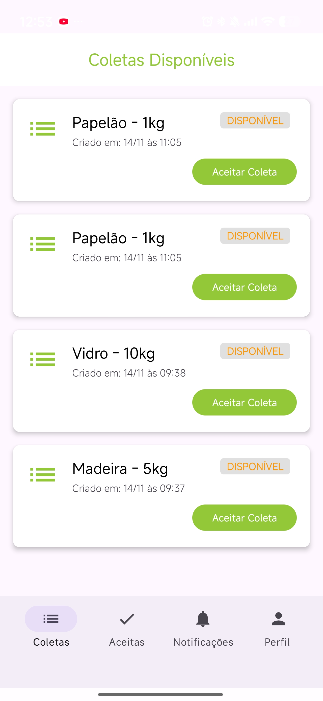
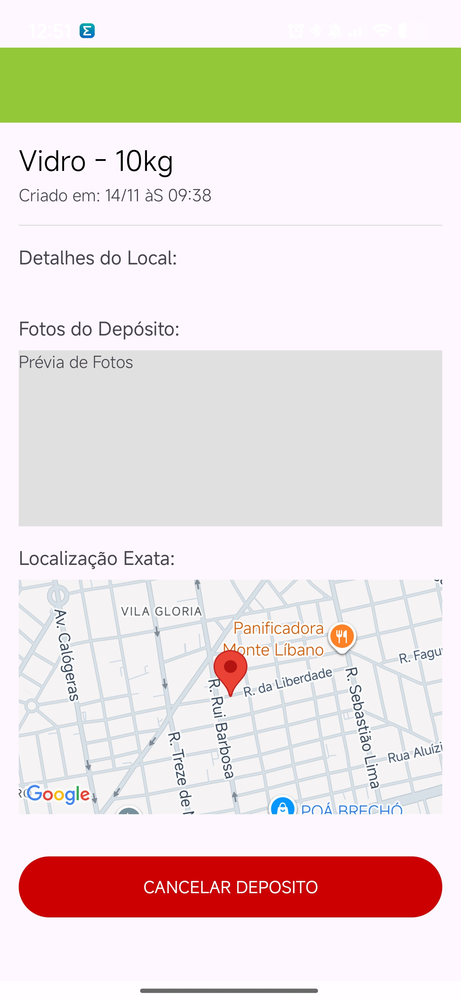

# Coleta Ai

## Sobre
Aplicativo Android criado para a disciplina "Projeto Integrador", voltado à gestão de coleta e depósito de resíduos recicláveis. O objetivo é facilitar a conexão entre quem descarta materiais e coletores autônomos, organizando informações essenciais como tipo de material, quantidade e localização.

## Funcionalidades
- Cadastro de usuários com perfis distintos (gerador e coletor)
- Registro de depósitos com:
  - tipo de material
  - quantidade e peso
  - descrição
  - fotos
  - localização automática
- Visualização de depósitos disponíveis para coleta
- Acesso a detalhes completos de cada depósito
- Integração com aplicativos de mapa para navegação até o local

## Tecnologias
- Java
- XML
- Firebase (autenticação e armazenamento)
- APIs de localização

## Como funciona
Usuários do tipo gerador registram depósitos de materiais recicláveis. Coletores podem visualizar esses depósitos, analisar as informações disponíveis e se deslocar até o local para realizar a coleta.

## Status
Projeto desenvolvido anteriormente e mantido como portfólio. As principais funcionalidades estão implementadas.

## Screenshots

### Autenticação
<table align="start">
  <tr>
    <td align="start">
       
      Cadastro
    </td>
    <td align="center">
       
      Login
    </td>
  </tr>
</table>

### Depósito e Coleta
<table align="start">
  <tr>
    <td align="start">
       
      Criação de depósito
    </td>
    <td align="start">
       
      Lista de coletas
    </td>
  </tr>
  <tr>
    <td align="start">
       
      Coletas disponíveis
    </td>
    <td align="start">
       
      Coletas aceitas
    </td>
  </tr>
</table>

### Detalhes
<table align="start">
  <tr>
    <td align="start">
       
      Detalhes do depósito
    </td>
  </tr>
</table>
